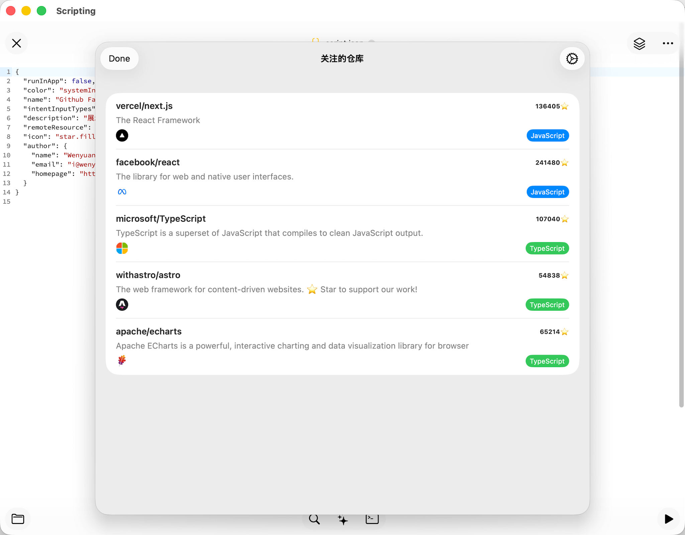

# Scripting APP Scripts 🚀

## Introduction 📖
存放一些 [Scripting APP](https://apps.apple.com/us/app/scripting/id6479691128?l=zh-Hans-CN) 的脚本

## Scripts 🛠️

### Hello World

[点击安装](https://scripting.fun/import_scripts?urls=%5B%22https%3A%2F%2Fgithub.com%2Fwenyuanw%2Fscripting%2Fraw%2Frefs%2Fheads%2Fmain%2Frelease%2FHello%2520World.scripting%22%5D)

- 源码路径：`scripts/Hello world`
- 一个简单的 Hello World 脚本示例，包含 i18n，小组件，页面，intent 等，精简自官方“每日记账”脚本。

### Github Favorites

[点击安装](https://scripting.fun/import_scripts?urls=%5B%22https%3A%2F%2Fgithub.com%2Fwenyuanw%2Fscripting%2Fraw%2Frefs%2Fheads%2Fmain%2Frelease%2FGithub%2520Favorites.scripting%22%5D)

- 源码路径：`scripts/Github Favorites`
- 展示你关注 GitHub 仓库列表。修改自 Github Trending 脚本(由于不知道作者信息，所以没有添加作者信息)。

  
  

## References 🔗
- [Scripting Doc](https://scripting.fun/doc_v2/zh/index)
- [Ryan's Github Repository](https://github.com/ryanfwy/scripting)
- [Github Trending Script](https://github.com/ryanfwy/scripting/tree/master/scripts/Github%20Trending)